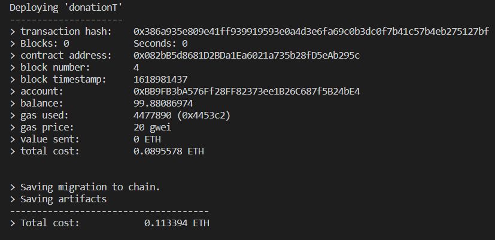

# Donation Tracking & Audting dApp

This repository contains an Ethereum DApp that demonstrates a Donation tracking between a Doner and Non-profit organization. The user story starts with the organization by registering to the platform. When it gets approval, the organization can raise campaign. Each organization must provide how many executors involved on the campaign operation plus their information. Each Executor information must be inserted in order based on their level of the operation. Depending on the campaign phase, the executor can change the operation states. if the state is complete, automatically the operation phase will move to the following executor, and the access to change its states. Every doner support those campaign can track these campaign operations and get every update of its state.


The DApp User Interface when running should look like...


### Prerequisites

Please make sure you've already installed Truffle, truffle box Webpack and enabled MetaMask extension in your browser.


### Installing

A step by step series of examples that tell you have to get a development env running

Clone this repository:

```
git clone https://github.com/NemerMu/codingdojo.git
```

On ```truffle-config.js``` Change Compailers version to ```0.8.0``` make sure the development host values are matching with other tools.

On the terminal go the project folder and start executing the following command to establish the development blockchain network
```
truffle develop
```

Your terminal should look something like this:




Now Compile smart contracts:

```
compile
```

Your terminal should look something like this:


This will create the smart contract artifacts in folder ```build\contracts```.

Migrate smart contracts to the locally running blockchain:

```
migrate --reset
```

Your terminal should look something like this:


Test smart contracts:

```
test
```

All 2 tests should pass.


In a separate terminal window, launch the DApp:

```
npm run dev
```


## Built With

* [Ethereum](https://www.ethereum.org/) - Ethereum is a decentralized platform that runs smart contracts
* [Truffle Framework](http://truffleframework.com/) - Truffle is the most popular development framework for Ethereum with a mission to make your life a whole lot easier.


## Authors

See also the list of [contributors](https://github.com/your/project/contributors.md) who participated in this project.

## Acknowledgments

* Solidity
* Truffle
* MetaMask
